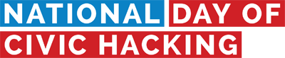
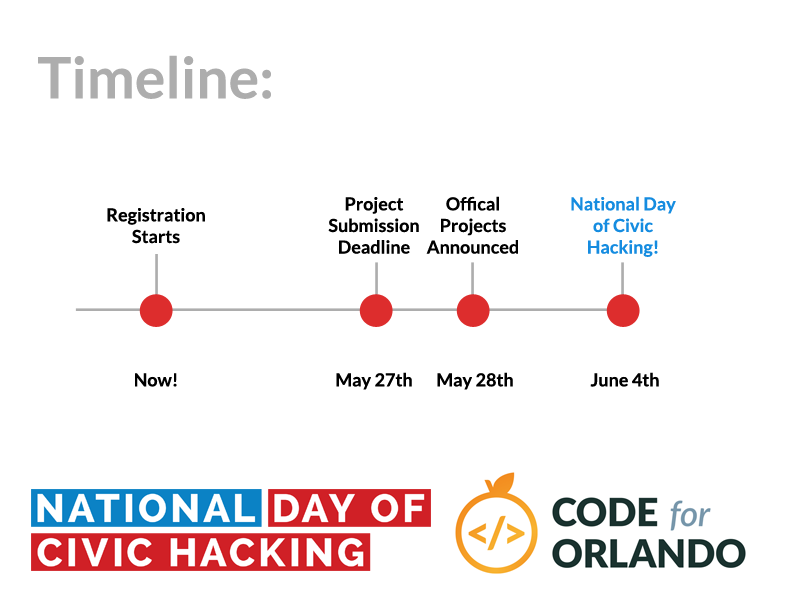

# Code for Orlando's National Day of Civic Hacking

## June 4th held @ Canvs 101 S. Garland Ave, Orlando Fl, 32801

#### [:rocket: RSVP as a Hacker :rocket:](http://bit.ly/ndoch2016)
#### [:bulb: Browse and Discuss Projects :bulb:](https://github.com/cforlando/2016-project-proposals/issues)
#### [:star2: Propose a Project :star2:](https://github.com/cforlando/2016-project-proposals/issues/new)

### Proposal submission deadline is May 27th.

_If you need help or have some specific questions, email codefororlando@gmail.com._

## Wondering how to propose or discuss your project ideas?

[GitHub Issues](https://guides.github.com/features/issues/) works just like any other commenting system on the Internet.

First, you'll need to [create an account](https://github.com/join).

Then you have two options: (1) comment on an existing idea (a.k.a. "issue"), or (2) create a new idea.

If you see an idea that you're interested in, click on it, read the discussion and then add your thoughts to the bottom of the discussion thread. If you don't see the idea you have in mind, [add a new one](https://github.com/cforlando/2016-project-proposals/issues/new). Someone from the Code for Orlando staff will respond with some questions or feedback.

*Here's a [quick video intro](https://www.youtube.com/watch?v=KlrJVSJRUN4) on using Github Issues for discussion.*

## I've submitted my proposal. What comes next?

Finalist projects will be announced on May 28th . All registered National Day of Civic Hacking participants will receive the announced projects and challenges. Additionally, at the event on Saturday, June 4th, all projects will be listed on a white board incase anyone has missed it. 

